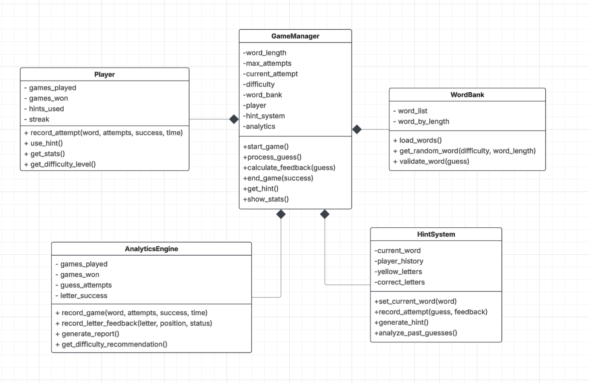

# WordleTrack

### Introduction
WordleTrack is a word puzzle game inspired by the classic Wordle, with enhanced data tracking and analytical insights. Players will guess a hidden word within a limited number of attempts (6 max). Each day, there will be two difficulty levels: 4-letter words and 5-letter words.
The game will track and analyze player performance through various statistical features. A key feature is the Sort Character Hint, which helps players place yellow-marked letters in their correct positions.

### Project Review
- Two difficulty levels: 4-letter and 5-letter words.
- Tracking and analyzing player behavior with detailed statistical data.
- Sort Character Hint: A feature that sorts misplaced letters into their correct positions.
- Dynamic word selection using a model to adjust difficulty over time.

### Programming Development
**Game Concept**
1. Enter a word guess.
2. Receive feedback on letter correctness 
   - Green: Correct letter in the correct position.
   - Yellow: Correct letter in the wrong position.
   - Gray: Letter not in the word.
3. Can request hints, which are based on their past performance.
4. Continue guessing until they find the correct word or run out of attempts (6 max).

**Object-Oriented Programming Implementation**
1. GameManager: Controls game flow and user interactions.
    - Attributes: Current word, attempts left, difficulty level 
    - Methods: start_game(), process_guess(), end_game()
2. WordBank: Stores words and selects words dynamically.
   - Attributes: Word list, difficulty mapping
   - Methods: get_random_word(difficulty), validate_word(guess)
3. Player: Stores player performance data.
   - Attributes: Name, past scores, hint usage
   - Methods: record_attempt(), update_score(), use_hint()
4. HintSystem: Sort Character Hint
   - Attributes: player_history, current_word, yellow_letters
   - Methods: generate_hint(), sort_hint(last_attempt), analyze_past_guesses()
5. AnalyticsEngine: Collects and processes statistical data.
   - Attributes: Guess attempts, time per round, success rate
   - Methods: calculate_letter_success(), generate_report()

**Algorithms Involved**
1. Letter Frequency Analysis: to suggest letters that are statistically more likely to appear in the hidden word.
2. Word Selection Optimization: Use weighted random selection to pick a word based on the player’s performance.
3. Sort Character Hint Algorithm: Uses a Constraint Propagation algorithm combined with pattern matching to reposition yellow-marked characters in their correct positions while maintaining relative order.
4. Statistical Analysis of Player Performance: Uses K-means Clustering to group players by skill level.
5. Difficulty Adjustment Algorithm: Provide feedback or recommendations to the player based on their performance across the three fixed difficulty levels.

**Data Analysis Report**
- Bar Graphs → To compare player performance across difficulty levels and visualize trends in hint usage.
- Pie Charts → For displaying win/loss ratios, providing insights into player behavior.
- Distribution Graphs → To understand the range of performance metrics, such as attempts and time taken to solve the word.
- Scatter Plots → To show correlations between various performance metrics, like attempts and time taken.

## Data Collected

| **Feature**              | **Why is it good to have this data? What can it be used for?**                                                                 | **How will you obtain 50 values of this feature data?**                                | **Which variable (and which class) will you collect this from?**                              | **How will you display this feature data (via summarization statistics or via graph)?**                                                  |
|--------------------------|----------------------------------------------------------------------------------------------------------------------------------|------------------------------------------------------------------------------------------|------------------------------------------------------------------------------------------------|------------------------------------------------------------------------------------------------------------------------|
| **Number of Attempts**   | Helps measure player efficiency and skill level. Can be used to assess game difficulty and track improvement over time.         | Collect data from 50 game sessions.                                                     | `attempts` from `Player` class                                                                | Distribution Graph to show attempts per round and track trends.                                                      |
| **Time Taken per Round** | Measures how long players take to solve a word. Useful for difficulty adjustments and analyzing engagement.                     | Collect data from 50 game sessions.                                                     | `time per round` from `AnalyticsEngine` class                                                 | Scatter Plot to analyze correlation between time taken and attempts.                                                |
| **Hint Usage Frequency** | Determines how often players use hints and whether it improves performance. Helps refine hint systems.                          | Collect data from 50 game sessions across multiple difficulty levels.                   | `hint usage` from `Player` class                                                              | Bar Graph to compare hint usage across different difficulty levels.                                                  |
| **Word Difficulty Level**| Analyzes how different words impact success rate and engagement. Can help optimize word selection.                              | Collect data from 50 game sessions categorized by difficulty level.                     | `Word list` from `WordBank` class and `success rate` from `AnalyticsEngine` class             | Pie Chart to show the proportion of games played at each difficulty.                                                |
| **Success Rate (Win/Loss)** | Measures overall player performance and engagement. Useful for assessing game balance.                                     | Collect data from 50 game sessions.                                                     | `success rate` from `AnalyticsEngine` class                                                   | Pie Chart for win/loss ratio.                                                                                         |

## Graph

## 📈 Graph Objectives and Visualization Details

This table outlines the objectives of various graphs, the types of graphs used, and the data dimensions represented on each axis.

| **Name**                        | **Graph Objective**                                                | **Graph Type**        | **X-axis**               | **Y-axis**           |
|----------------------------------|---------------------------------------------------------------------|------------------------|--------------------------|----------------------|
| **Number of Attempts**           | Show distribution of player attempts per game                      | Histogram              | Number of Attempts       | Frequency            |
| **Success Rate (Win/Loss)**      | Show proportion of successful vs. failed games                     | Pie Chart              | Win/Loss Categories      | Games (%)            |
| **Difficulty Level vs. Success Rate** | Investigate if difficulty level affects success rate          | Bar Graph              | Difficulty Level         | Success Rate (%)     |
| **Hint Usage Frequency**         | Compare hint usage across difficulty levels                        | Stacked Bar Graph      | Difficulty Level         | Hint Usage Count     |
| **Time Taken per Round**         | Show the distribution of time taken per round                      | Line Graph             | Difficulty Level         | Time Taken           |

## UML Class Diagram

